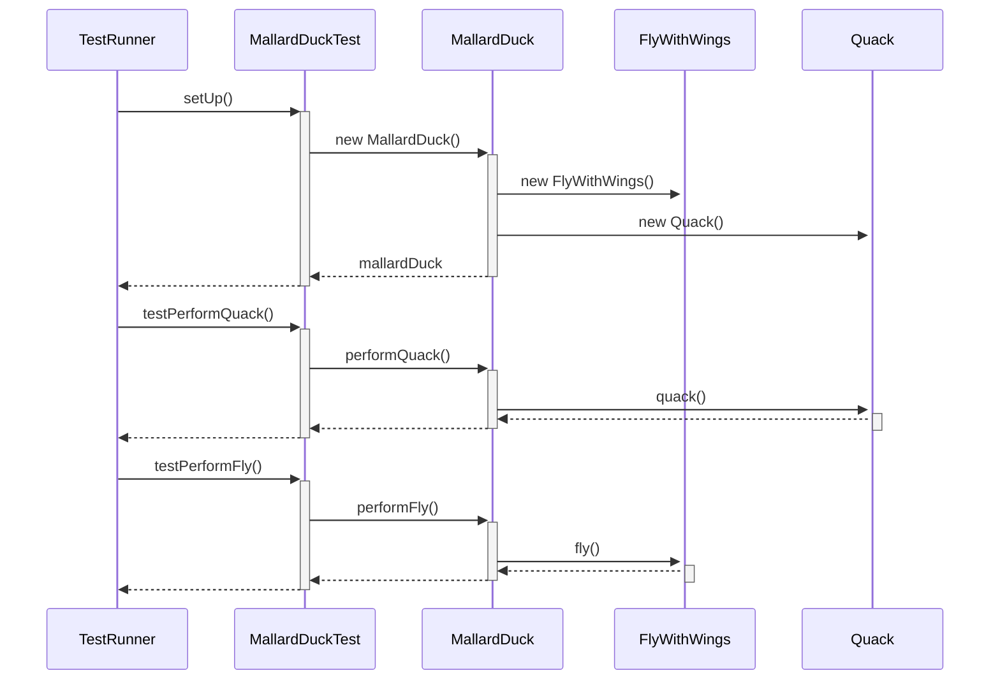

```mermaid
sequenceDiagram
    participant TestRunner
    participant MallardDuckTest
    participant MallardDuck
    participant FlyWithWings
    participant Quack

    TestRunner->>+MallardDuckTest: setUp()
    MallardDuckTest->>+MallardDuck: new MallardDuck()
    MallardDuck->>+FlyWithWings: new FlyWithWings()
    MallardDuck->>+Quack: new Quack()
    MallardDuck-->>-MallardDuckTest: mallardDuck
    MallardDuckTest-->>-TestRunner:

    %% Blank line to separate transactions

    TestRunner->>+MallardDuckTest: testPerformQuack()
    MallardDuckTest->>+MallardDuck: performQuack()
    MallardDuck->>+Quack: quack()
    Quack-->>-MallardDuck:
    MallardDuck-->>-MallardDuckTest:
    MallardDuckTest-->>-TestRunner:

    TestRunner->>+MallardDuckTest: testPerformFly()
    MallardDuckTest->>+MallardDuck: performFly()
    MallardDuck->>+FlyWithWings: fly()
    FlyWithWings-->>-MallardDuck:
    MallardDuck-->>-MallardDuckTest:
    MallardDuckTest-->>-TestRunner:
```
