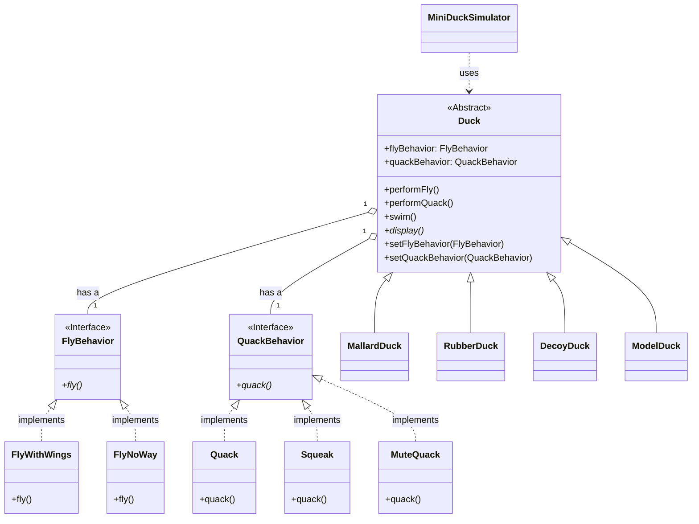

# Strategy Pattern Class Diagram

```mermaid
classDiagram
    %% --- Interfaces and Abstract Classes ---
    class Duck {
        <<Abstract>>
        +flyBehavior: FlyBehavior
        +quackBehavior: QuackBehavior
        +performFly()
        +performQuack()
        +swim()
        +display()*
        +setFlyBehavior(FlyBehavior)
        +setQuackBehavior(QuackBehavior)
    }

    class FlyBehavior {
        <<Interface>>
        +fly()*
    }

    class QuackBehavior {
        <<Interface>>
        +quack()*
    }

    %% --- Concrete Duck Types ---
    class MallardDuck
    class RubberDuck
    class DecoyDuck
    class ModelDuck

    %% --- Concrete Fly Behaviors ---
    class FlyWithWings {
        +fly()
    }
    class FlyNoWay {
        +fly()
    }

    %% --- Concrete Quack Behaviors ---
    class Quack {
        +quack()
    }
    class Squeak {
        +quack()
    }
    class MuteQuack {
        +quack()
    }
    
    %% --- Client ---
    class MiniDuckSimulator

    %% --- Relationships ---
    Duck "1" o-- "1" FlyBehavior : has a
    Duck "1" o-- "1" QuackBehavior : has a

    Duck <|-- MallardDuck
    Duck <|-- RubberDuck
    Duck <|-- DecoyDuck
    Duck <|-- ModelDuck

    FlyBehavior <|.. FlyWithWings : implements
    FlyBehavior <|.. FlyNoWay : implements

    QuackBehavior <|.. Quack : implements
    QuackBehavior <|.. Squeak : implements
    QuackBehavior <|.. MuteQuack : implements
    
    MiniDuckSimulator ..> Duck : uses

```
